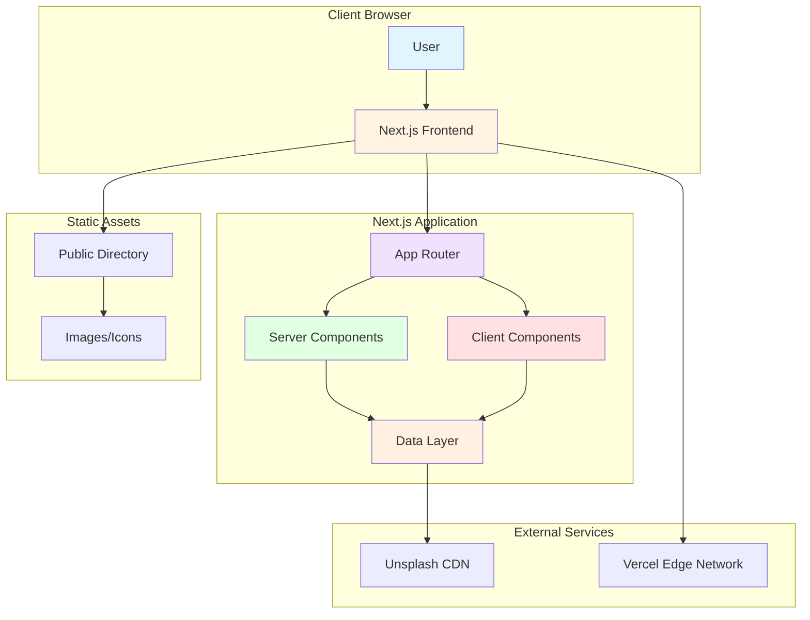
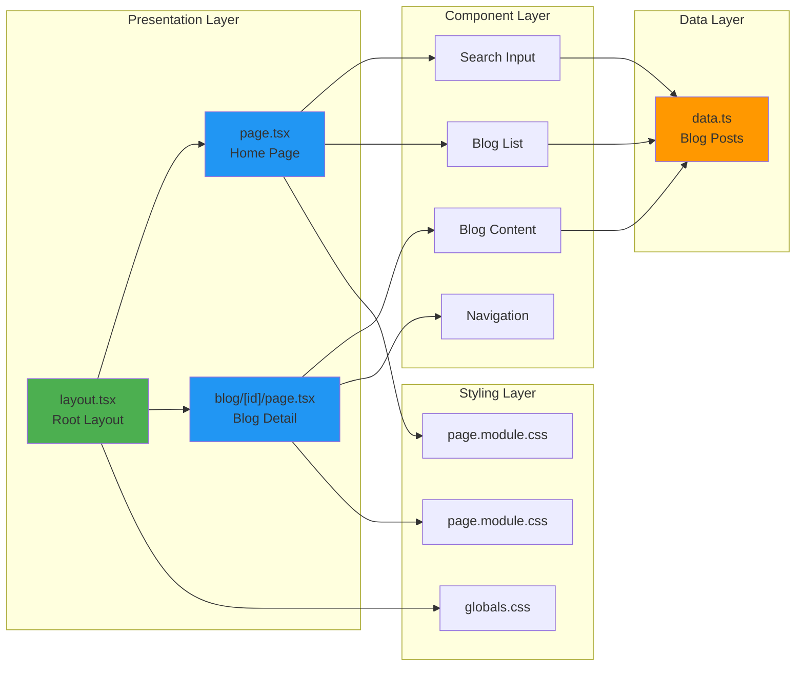
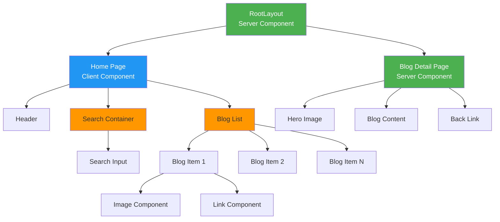
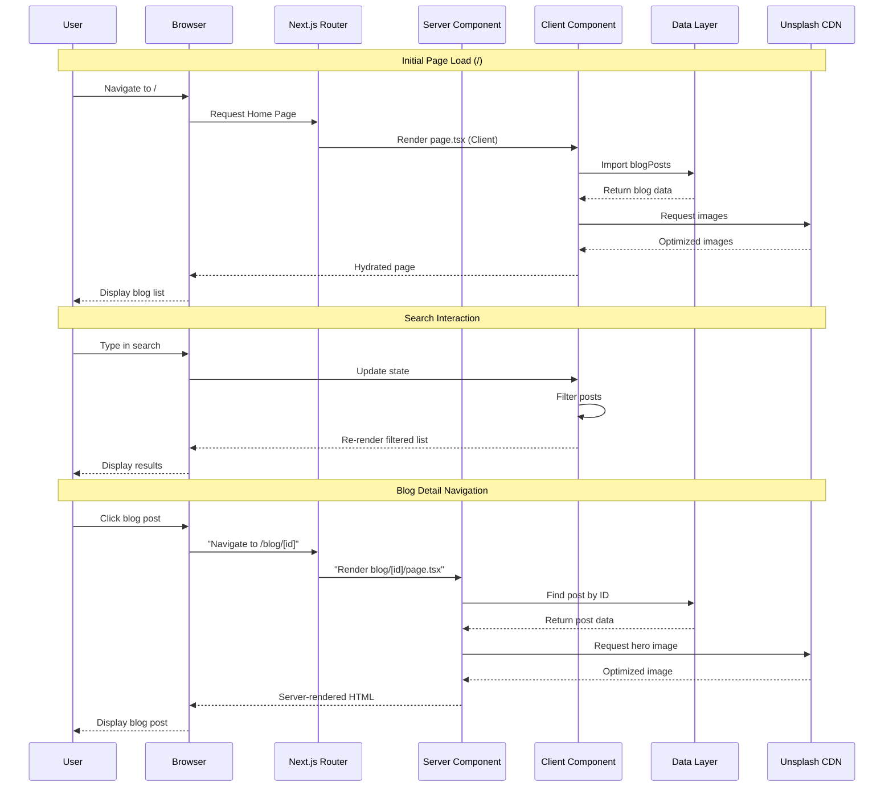
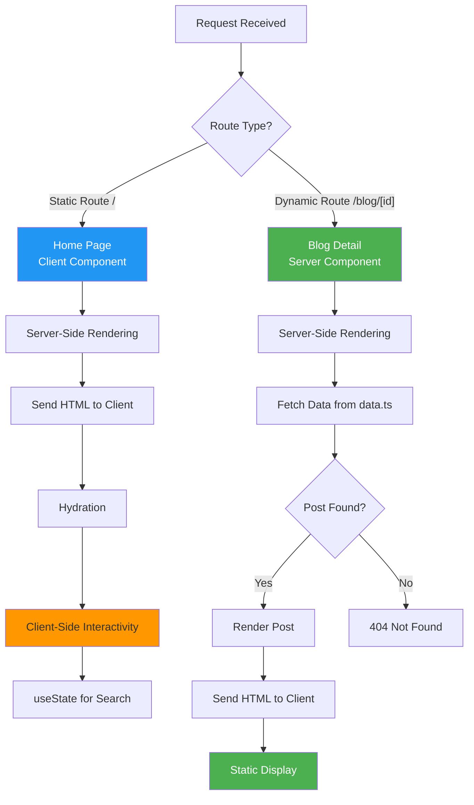
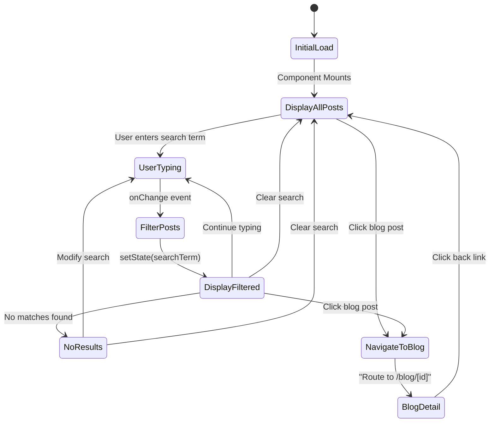
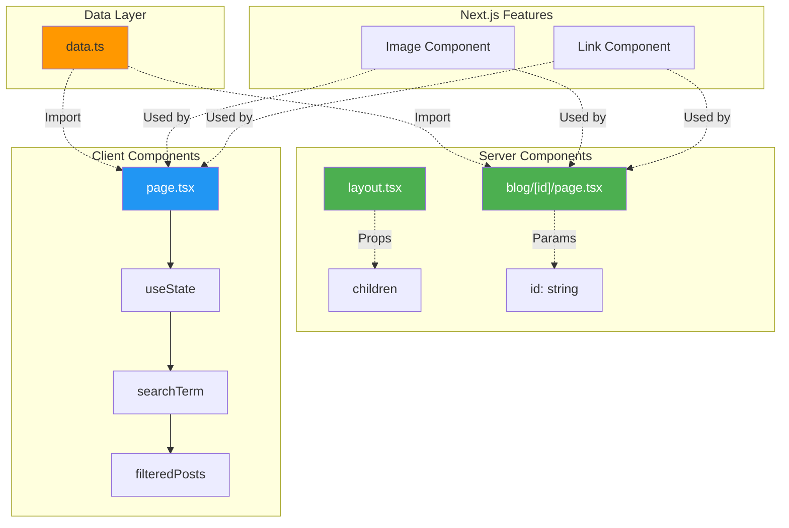
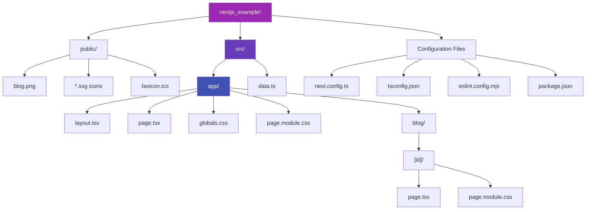
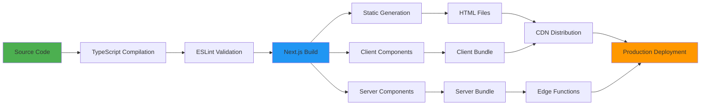

# 🏗️ Architecture Documentation

## Table of Contents

1. [System Overview](#system-overview)
2. [Architecture Diagrams](#architecture-diagrams)
3. [Component Architecture](#component-architecture)
4. [Data Flow](#data-flow)
5. [Routing Architecture](#routing-architecture)
6. [Rendering Strategy](#rendering-strategy)
7. [Technology Stack](#technology-stack)
8. [Design Patterns](#design-patterns)

---

## System Overview

This Next.js 16 blog application follows a modern **App Router architecture** with a clear separation between Server and Client Components. The system is designed for optimal performance, SEO, and developer experience.

### Key Architectural Principles

- **Server-First Rendering**: Default to Server Components for better performance
- **Progressive Enhancement**: Client-side interactivity only where needed
- **Type Safety**: Full TypeScript coverage across the application
- **Component Isolation**: CSS Modules for scoped styling
- **Image Optimization**: Automatic optimization via Next.js Image component
- **File-Based Routing**: Intuitive routing through directory structure

---

## Architecture Diagrams

### 1. High-Level System Architecture



### 2. Application Layer Architecture



### 3. Component Hierarchy



### 4. Data Flow Diagram



### 5. Routing Architecture

```mermaid
graph TD
    A[App Router] --> B[/ Root]
    B --> C[layout.tsx<br/>Root Layout<br/>Server Component]
    B --> D[page.tsx<br/>Home Page<br/>Client Component]
    B --> E[globals.css<br/>Global Styles]
    
    B --> F[/blog Dynamic Route]
    F --> G["/blog/[id]"]
    G --> H[page.tsx<br/>Blog Detail<br/>Server Component]
    G --> I[page.module.css<br/>Scoped Styles]
    
    D --> J[page.module.css<br/>Scoped Styles]
    
    style A fill:#9C27B0,color:#fff
    style C fill:#4CAF50,color:#fff
    style D fill:#2196F3,color:#fff
    style H fill:#4CAF50,color:#fff
```

### 6. Rendering Strategy Flow



### 7. State Management Flow



### 8. Component Communication Pattern



### 9. File System Structure



### 10. Build & Deployment Pipeline



---

## Component Architecture

### Server Components

Server Components render on the server and send HTML to the client. They provide optimal performance and SEO.

#### [`layout.tsx`](src/app/layout.tsx:1)

**Type**: Server Component (default)  
**Purpose**: Root layout wrapper for the entire application

**Responsibilities**:

- Define HTML structure (`<html>`, `<body>`)
- Configure fonts (Geist Sans & Mono)
- Set metadata (title, description, favicon)
- Provide global styles
- Wrap all pages with consistent layout

**Key Features**:

```typescript
// Font optimization with variable fonts
const geistSans = Geist({
  variable: "--font-geist-sans",
  subsets: ["latin"],
});

// Metadata for SEO
export const metadata: Metadata = {
  title: "My Blog",
  description: "A modern blog built with Next.js",
};
```

#### [`blog/[id]/page.tsx`](src/app/blog/[id]/page.tsx:1)

**Type**: Server Component (default)  
**Purpose**: Dynamic blog post detail pages

**Responsibilities**:

- Fetch blog post data by ID
- Handle 404 for non-existent posts
- Render blog content with hero image
- Provide navigation back to home

**Key Features**:

```typescript
// Async params handling (Next.js 15+)
export default async function BlogPost({ params }: PageProps) {
  const { id } = await params;
  const post = blogPosts.find((p) => p.id === parseInt(id));
  
  if (!post) {
    notFound(); // Built-in 404 handling
  }
}
```

**Data Flow**:

1. Receive dynamic `id` parameter from URL
2. Query blog post from data layer
3. Validate post existence
4. Render server-side HTML
5. Send optimized HTML to client

### Client Components

Client Components enable interactivity and use React hooks. They hydrate on the client side.

#### [`page.tsx`](src/app/page.tsx:1)

**Type**: Client Component (`'use client'`)  
**Purpose**: Home page with blog listing and search

**Responsibilities**:

- Display all blog posts in a grid
- Provide real-time search functionality
- Handle user interactions
- Filter posts based on search term

**Key Features**:

```typescript
// Client-side state management
const [searchTerm, setSearchTerm] = useState("");

// Real-time filtering
const filteredPosts = blogPosts.filter((post) =>
  post.title.toLowerCase().includes(searchTerm.toLowerCase()) ||
  post.content.toLowerCase().includes(searchTerm.toLowerCase())
);
```

**State Management**:

- `searchTerm`: Tracks user input
- `filteredPosts`: Computed from search term
- Re-renders on state change

---

## Data Flow

### Data Layer Architecture

#### [`data.ts`](src/data.ts:1)

**Purpose**: Centralized data source for blog posts

**Structure**:

```typescript
export interface BlogPost {
  id: number;
  title: string;
  content: string;
  date: string;
  author: string;
  image: string;
}

const blogPosts: BlogPost[] = [/* ... */];
export default blogPosts;
```

**Design Decisions**:

- **Static Data**: Currently uses in-memory array
- **Type Safety**: TypeScript interface ensures data consistency
- **Extensibility**: Can be replaced with database/CMS without changing components
- **Single Source of Truth**: All components import from this module

### Data Access Patterns

1. **Server Component Access** (Blog Detail):

   ```typescript
   import blogPosts from "@/data";
   const post = blogPosts.find((p) => p.id === parseInt(id));
   ```

2. **Client Component Access** (Home Page):

   ```typescript
   import blogPosts from "@/data";
   const filteredPosts = blogPosts.filter(/* ... */);
   ```

---

## Routing Architecture

### App Router Structure

```
src/app/
├── layout.tsx          → Root layout (all pages)
├── page.tsx            → / (home page)
├── globals.css         → Global styles
├── page.module.css     → Home page styles
└── blog/
    └── [id]/           → /blog/:id (dynamic route)
        ├── page.tsx    → Blog detail page
        └── page.module.css → Blog detail styles
```

### Route Types

#### Static Route: `/`

- **Component**: [`page.tsx`](src/app/page.tsx:1)
- **Type**: Client Component
- **Rendering**: Server-side initial render + client hydration
- **Features**: Search, filtering, navigation

#### Dynamic Route: `/blog/[id]`

- **Component**: [`blog/[id]/page.tsx`](src/app/blog/[id]/page.tsx:1)
- **Type**: Server Component
- **Rendering**: Server-side only
- **Features**: Dynamic parameter, 404 handling

### Navigation Flow

```
User clicks blog post
    ↓
Next.js Link component
    ↓
Client-side navigation (no full page reload)
    ↓
Server Component renders on server
    ↓
HTML sent to client
    ↓
Page displayed
```

---

## Rendering Strategy

### Hybrid Rendering Approach

This application uses a **hybrid rendering strategy** combining Server and Client Components for optimal performance.

#### Server-Side Rendering (SSR)

**Used For**:

- Blog detail pages ([`blog/[id]/page.tsx`](src/app/blog/[id]/page.tsx:1))
- Root layout ([`layout.tsx`](src/app/layout.tsx:1))

**Benefits**:

- Better SEO (fully rendered HTML)
- Faster initial page load
- Reduced JavaScript bundle size
- Direct data access

#### Client-Side Rendering (CSR)

**Used For**:

- Home page with search ([`page.tsx`](src/app/page.tsx:1))

**Benefits**:

- Interactive UI elements
- Real-time filtering
- Instant feedback
- Rich user experience

### Performance Optimizations

1. **Image Optimization**
   - Next.js Image component
   - Automatic format selection (WebP, AVIF)
   - Lazy loading
   - Responsive images

2. **Font Optimization**
   - Variable fonts (Geist Sans & Mono)
   - Subset loading (Latin only)
   - CSS variables for font families

3. **Code Splitting**
   - Automatic route-based splitting
   - Dynamic imports where needed
   - Minimal client-side JavaScript

4. **CSS Modules**
   - Scoped styles prevent conflicts
   - Automatic class name hashing
   - Dead code elimination

---

## Technology Stack

### Core Framework

- **Next.js 16.0.6**: React framework with App Router
- **React 19.2.0**: UI library with latest features
- **TypeScript 5.x**: Type-safe development

### Styling

- **CSS Modules**: Component-scoped styling
- **CSS Variables**: Theme customization
- **Responsive Design**: Mobile-first approach

### Development Tools

- **ESLint 9**: Code quality enforcement
- **TypeScript Compiler**: Type checking
- **Next.js Dev Server**: Hot reload

### External Services

- **Unsplash CDN**: Image hosting and optimization
- **Vercel Edge Network**: Global content delivery

---

## Design Patterns

### 1. Component Composition Pattern

Components are composed hierarchically with clear parent-child relationships:

```
RootLayout (Server)
  └── Page (Client/Server)
      └── Child Components
```

### 2. Container/Presentational Pattern

- **Container**: [`page.tsx`](src/app/page.tsx:1) manages state and logic
- **Presentational**: Blog items render data without logic

### 3. Server-First Pattern

Default to Server Components, use Client Components only when needed:

- ✅ Server: Blog detail (no interactivity needed)
- ✅ Client: Home page (search requires state)

### 4. File-Based Routing Pattern

Routes are defined by file structure, not configuration:

- `app/page.tsx` → `/`
- `app/blog/[id]/page.tsx` → `/blog/:id`

### 5. CSS Modules Pattern

Scoped styling prevents global namespace pollution:

```typescript
import styles from './page.module.css';
<div className={styles.container}>
```

### 6. Type-Safe Data Pattern

TypeScript interfaces ensure data consistency:

```typescript
interface BlogPost {
  id: number;
  title: string;
  // ...
}
```

### 7. Progressive Enhancement Pattern

Core functionality works without JavaScript, enhanced with interactivity:

- Blog posts render server-side (works without JS)
- Search adds client-side enhancement

### 8. Separation of Concerns

Clear separation between:

- **Presentation**: Components (`.tsx`)
- **Styling**: CSS Modules (`.module.css`)
- **Data**: Data layer ([`data.ts`](src/data.ts:1))
- **Configuration**: Config files

---

## Configuration Architecture

### [`next.config.ts`](next.config.ts:1)

```typescript
const nextConfig: NextConfig = {
  images: {
    remotePatterns: [
      {
        protocol: 'https',
        hostname: 'images.unsplash.com',
        pathname: '/**',
      },
    ],
  },
};
```

**Purpose**: Configure Next.js behavior

- Image domain allowlist for security
- Type-safe configuration with TypeScript

### [`tsconfig.json`](tsconfig.json:1)

**Purpose**: TypeScript compiler configuration

- Path aliases (`@/` → `src/`)
- Strict type checking
- JSX support for React

### [`eslint.config.mjs`](eslint.config.mjs:1)

**Purpose**: Code quality enforcement

- Next.js recommended rules
- TypeScript integration
- Flat config format (ESLint 9+)

---

## Future Architecture Considerations

### Scalability Enhancements

1. **Database Integration**
   - Replace [`data.ts`](src/data.ts:1) with database queries
   - Add data fetching layer
   - Implement caching strategy

2. **API Routes**
   - Add `/api` directory for backend endpoints
   - Implement RESTful or GraphQL API
   - Add authentication/authorization

3. **State Management**
   - Consider Zustand/Redux for complex state
   - Implement global state if needed
   - Add context providers

4. **Testing Infrastructure**
   - Unit tests for components
   - Integration tests for pages
   - E2E tests with Playwright

5. **Performance Monitoring**
   - Add analytics integration
   - Implement error tracking
   - Monitor Core Web Vitals

### Architectural Patterns to Consider

- **Repository Pattern**: Abstract data access
- **Service Layer**: Business logic separation
- **Middleware Pattern**: Request/response processing
- **Observer Pattern**: Event-driven updates
- **Factory Pattern**: Component creation

---

## Conclusion

This architecture provides a solid foundation for a modern, performant blog application. The hybrid rendering strategy, type-safe development, and clear separation of concerns make the codebase maintainable and scalable.

**Key Strengths**:

- ✅ Optimal performance with Server Components
- ✅ Type safety with TypeScript
- ✅ SEO-friendly server-side rendering
- ✅ Interactive client-side features
- ✅ Clean, maintainable code structure

**Last Updated**: December 2025  
**Next.js Version**: 16.0.6  
**Architecture Pattern**: App Router with Hybrid Rendering
