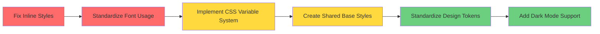

# CSS Usage Analysis & Outliers Report

## Executive Summary

This analysis identifies critical CSS inconsistencies, outliers, and violations of the project's stated best practices across the Next.js blog application.

**Severity Levels:**
- 🔴 **Critical**: Breaks documented standards, affects maintainability
- 🟡 **High**: Inconsistencies that reduce code quality
- 🟢 **Medium**: Improvements for better practices

---

## 🔴 Critical Issues

### 1. Inline Styles Violate CSS Modules Pattern

**Location**: [`src/app/page.tsx:41`](src/app/page.tsx:41) and [`src/app/blog/[id]/page.tsx:29`](src/app/blog/[id]/page.tsx:29)

**Problem**: 
```typescript
// page.tsx line 41
style={{ width: '100%', height: '200px', objectFit: 'cover', borderRadius: '10px 10px 0 0' }}

// page.tsx line 43
style={{ padding: '15px' }}

// blog/[id]/page.tsx line 29
style={{ width: '100%', height: '400px', objectFit: 'cover', borderRadius: '10px', marginBottom: '20px' }}
```

**Impact**: 
- Violates documented CSS Modules best practices from [`CONTRIBUTING.md`](CONTRIBUTING.md:334-369)
- Prevents reusability and increases maintenance burden
- Inline styles cannot be optimized by Next.js build process
- Makes responsive design harder to manage

**Referenced Classes Not Defined**:
- `.blogImage` (used in [`page.tsx:40`](src/app/page.tsx:40)) - **NOT FOUND** in [`page.module.css`](src/app/page.module.css:1)
- `.postImage` (used in [`blog/[id]/page.tsx:28`](src/app/blog/[id]/page.tsx:28)) - **NOT FOUND** in [`blog/[id]/page.module.css`](src/app/blog/[id]/page.module.css:1)

---

### 2. Font Family Configuration Conflict

**Location**: [`globals.css:22`](src/app/globals.css:22) vs [`layout.tsx:5-12`](src/app/layout.tsx:5-12)

**Problem**:
```css
/* globals.css line 22 */
font-family: Arial, Helvetica, sans-serif;
```

```typescript
/* layout.tsx lines 5-12 - Geist fonts configured but NOT USED */
const geistSans = Geist({
  variable: "--font-geist-sans",
  subsets: ["latin"],
});

const geistMono = Geist_Mono({
  variable: "--font-geist-mono",
  subsets: ["latin"],
});
```

**Impact**:
- Geist fonts are loaded (performance cost) but never applied
- Hardcoded Arial font in CSS overrides the optimized variable fonts
- Wastes bandwidth loading unused font files
- Inconsistent with Next.js font optimization strategy

---

### 3. Hardcoded Font Families in CSS Modules

**Location**: [`page.module.css:5`](src/app/page.module.css:5) and [`blog/[id]/page.module.css:5`](src/app/blog/[id]/page.module.css:5)

**Problem**:
```css
/* page.module.css line 5 */
font-family: 'Segoe UI', Tahoma, Geneva, Verdana, sans-serif;

/* blog/[id]/page.module.css line 5 */
font-family: 'Segoe UI', Tahoma, Geneva, Verdana, sans-serif;
```

**Impact**:
- Overrides global font settings with different font stack
- Creates inconsistent typography across pages
- Should use CSS variables: `var(--font-geist-sans)` or inherit from body

---

## 🟡 High Priority Issues

### 4. CSS Variables Not Utilized

**Location**: [`globals.css:1-4`](src/app/globals.css:1-4) vs component styles

**Problem**:
CSS variables are defined but hardcoded values are used instead:

```css
/* globals.css defines */
:root {
  --background: #ffffff;
  --foreground: #171717;
}

/* But page.module.css uses hardcoded colors */
color: #333;           /* line 8 */
color: #fff;           /* line 19 */
color: #2c3e50;        /* line 79 */
color: #7f8c8d;        /* line 86 */
```

**Missing CSS Variables**:
- No `--primary-color` or `--accent-color` defined
- No `--spacing-*` variables for consistent spacing
- No `--border-radius` variables (10px, 15px, 25px, 50px used inconsistently)
- No `--shadow-*` variables for box shadows

**Impact**:
- Theme switching (dark mode) won't affect component-specific colors
- Harder to maintain consistent design system
- Violates documented best practice from [`CONTRIBUTING.md:370-413`](CONTRIBUTING.md:370-413)

---

### 5. Duplicate Container Styles

**Location**: [`page.module.css:1-9`](src/app/page.module.css:1-9) vs [`blog/[id]/page.module.css:1-9`](src/app/blog/[id]/page.module.css:1-9)

**Problem**:
Both files define `.container` with similar but inconsistent properties:

```css
/* page.module.css */
.container {
  max-width: 1200px;      /* Different max-width */
  padding: 20px;
  font-family: 'Segoe UI', Tahoma, Geneva, Verdana, sans-serif;
  background: linear-gradient(135deg, #667eea 0%, #764ba2 100%);
  min-height: 100vh;
  color: #333;
}

/* blog/[id]/page.module.css */
.container {
  max-width: 800px;       /* Different max-width */
  padding: 40px 20px;     /* Different padding */
  font-family: 'Segoe UI', Tahoma, Geneva, Verdana, sans-serif;
  background: linear-gradient(135deg, #f5f7fa 0%, #c3cfe2 100%);
  min-height: 100vh;
  color: #333;
}
```

**Impact**:
- Code duplication reduces maintainability
- Inconsistent padding and max-width patterns
- Should use shared base styles or CSS variables

---

### 6. Inconsistent Border Radius Values

**Found**: 10px, 15px, 25px, 50px used across different elements

**Locations**:
- `10px`: Image borders (inline styles), blog items
- `15px`: Blog item cards ([`page.module.css:57`](src/app/page.module.css:57))
- `25px`: Back link button ([`blog/[id]/page.module.css:40`](src/app/blog/[id]/page.module.css:40))
- `50px`: Search input ([`page.module.css:36`](src/app/page.module.css:36))

**Impact**:
- No design system consistency
- Should define `--radius-sm`, `--radius-md`, `--radius-lg`, `--radius-full`

---

### 7. Gradient Backgrounds Not Themeable

**Location**: [`page.module.css:6`](src/app/page.module.css:6) and [`blog/[id]/page.module.css:6`](src/app/blog/[id]/page.module.css:6)

**Problem**:
```css
background: linear-gradient(135deg, #667eea 0%, #764ba2 100%);
background: linear-gradient(135deg, #f5f7fa 0%, #c3cfe2 100%);
```

**Impact**:
- Hardcoded gradients won't adapt to dark mode
- No CSS variable alternatives defined
- Users with `prefers-color-scheme: dark` get poor experience

---

## 🟢 Medium Priority Issues

### 8. Box Shadow Inconsistencies

**Found**: Multiple shadow values with no standardization:

- `0 4px 6px rgba(0,0,0,0.1)` - Search input ([`page.module.css:37`](src/app/page.module.css:37))
- `0 6px 12px rgba(0,0,0,0.15)` - Search input focus ([`page.module.css:43`](src/app/page.module.css:43))
- `0 8px 32px rgba(0,0,0,0.1)` - Blog items ([`page.module.css:59`](src/app/page.module.css:59))
- `0 15px 35px rgba(0,0,0,0.2)` - Blog items hover ([`page.module.css:67`](src/app/page.module.css:67))
- `0 4px 15px rgba(52, 152, 219, 0.3)` - Back link ([`blog/[id]/page.module.css:43`](src/app/blog/[id]/page.module.css:43))

**Recommendation**: Define shadow scale in CSS variables

---

### 9. Color Palette Not Documented

**Colors Found**:
- Purples: `#667eea`, `#764ba2`
- Grays: `#f5f7fa`, `#c3cfe2`, `#2c3e50`, `#7f8c8d`, `#34495e`
- Blues: `#3498db`, `#2980b9`
- Whites/Blacks: `#fff`, `#333`

**Impact**: No centralized color system makes updates difficult

---

### 10. Missing CSS Classes for Responsive Images

**Problem**: Images use inline styles for responsive behavior instead of CSS classes with media queries

**Current**:
```typescript
style={{ width: '100%', height: '200px', objectFit: 'cover' }}
```

**Should be**:
```css
.blogImage {
  width: 100%;
  height: 200px;
  object-fit: cover;
  border-radius: var(--radius-md);
}
```

---

## Impact Summary

| Issue | Severity | Files Affected | LOC Impact |
|-------|----------|----------------|------------|
| Inline styles | 🔴 Critical | 2 | ~10 lines |
| Font configuration conflict | 🔴 Critical | 2 | ~5 lines |
| Hardcoded fonts in modules | 🔴 Critical | 2 | 2 lines |
| CSS variables not used | 🟡 High | 3 | ~30 lines |
| Duplicate container styles | 🟡 High | 2 | ~18 lines |
| Border radius inconsistency | 🟡 High | 2 | ~8 lines |
| Non-themeable gradients | 🟡 High | 2 | 2 lines |
| Box shadow inconsistency | 🟢 Medium | 2 | ~8 lines |
| Undocumented color palette | 🟢 Medium | 2 | N/A |
| Missing responsive classes | 🟢 Medium | 2 | ~6 lines |

---

## Architectural Violations

The following documented best practices are violated:

1. **CSS Modules Pattern** ([`CONTRIBUTING.md:334-369`](CONTRIBUTING.md:334-369))
   - ❌ Inline styles used instead of CSS Modules classes

2. **CSS Variables for Theming** ([`CONTRIBUTING.md:370-413`](CONTRIBUTING.md:370-413))
   - ❌ Hardcoded colors instead of `var(--foreground)`, `var(--background)`

3. **Font Optimization** ([`CONTRIBUTING.md:414-428`](CONTRIBUTING.md:414-428))
   - ❌ Geist fonts loaded but not applied
   - ❌ Hardcoded font stacks override optimization

4. **Mobile-First Approach** ([`CONTRIBUTING.md:382-397`](CONTRIBUTING.md:382-397))
   - ⚠️ Partially followed, but inline styles bypass responsive breakpoints

---

## Recommendations Priority Matrix



**Phase 1 (Critical)**: Fix inline styles, font configuration  
**Phase 2 (High)**: Implement CSS variables, remove duplication  
**Phase 3 (Medium)**: Standardize design tokens, enhance theming